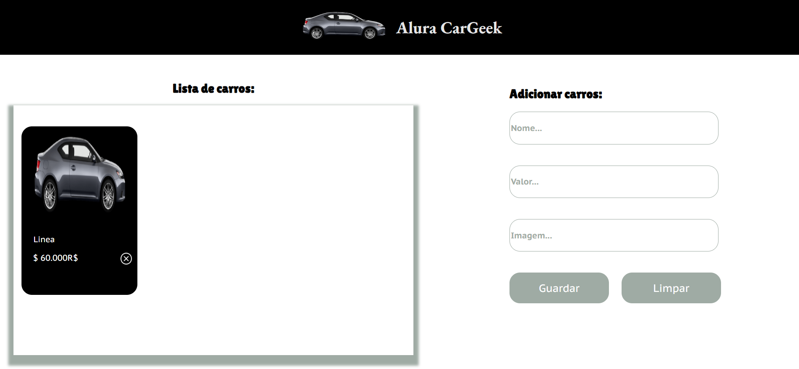

# (Intro) AluraCarGeek
Projeto desenvolvido durante formação no curso de Front End da Oracle + Alura. Foi desenvolvida uma página com as tecnologias, HTML, CSS e JavaScript. Nessa página é possível criar, ler, atualizar e deletar produtos em um simulador de e-commerce.
## (A) Funcionalidades

- **Adicionar produtos**: Possibilidade de cadastrar produtos ao catálogo via API.
- **Deletar produtos**: Possibilidade de interação com a página para excluir cadastros de produtos do catálogo.
- **Exibição de produtos**: Foi feito uma simulação de API, onde os dados são armazenados e alterados.
- **Manipulação do DOM**: Dinâmica na atualização da página com os dados dos produtos.



## (B) Requisitos

- Node.js instalado
- JSON Server instalado globalmente
  
## (C) Tecnologias Utilizadas

- **HTML5**: Estrutura e layout da página.
- **CSS3**: Estilização da página trazendo uma interface agradavel e de fácil ultilização e 
- **JavaScript**: Manipulação do DOM e requisições à API.
- **JSON Server**: Simulação de API para operações com os produtos.


## (D) Como Executar

1. **Clonagem do repositório no GitHub**:
    ```bash
    git clone https://github.com/Alyssonafsantos/alura-car-geek
    ```
    
2. **Instalação do JSON Server pelo terminal** 
    ```bash
    npm install -g json-server
    ```

3. **Start do JSON Server no terminal**:
    ```bash
    json-server --watch db.json
    ```
    
4. **Abrir o arquivo `index.html`** no navegador.

5. **Para adicionar produtos**: coloque as devidas informações requisitada na página. No campo imagem você pode colar uma url valida de uma imagem, ou mesmo usar uma imagem do seu repositório que terá o nome inicial imagens. Digite no campo "Imagem" do formulário o caminho `imagens/nomeDaImagem.extensão`.

## (E) Estrutura de Arquivos

- `db.json`: Arquivo utilizado pelo JSON Server para simular a API.
- `.js`: Script para manipulação de dados e eventos.
- `index.html`: Página principal do e-commerce.
- `styles.css`: Estilos para a página.


Desenvolvido por https://github.com/Alyssonafsantos
